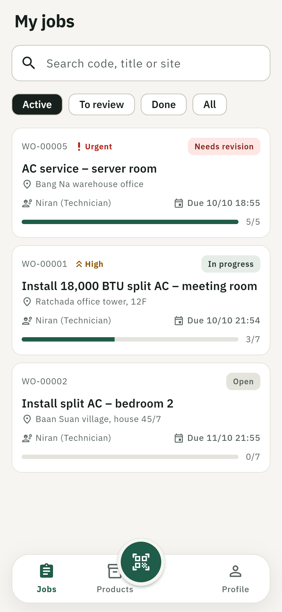
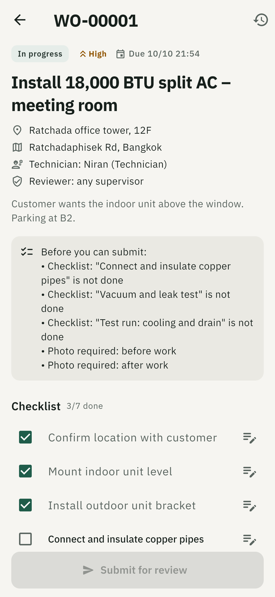
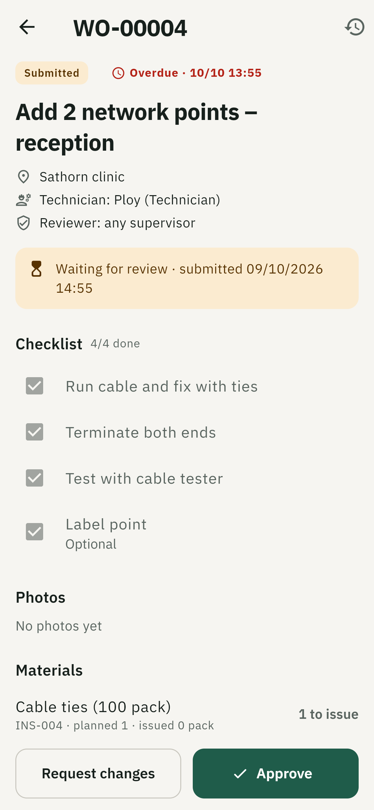
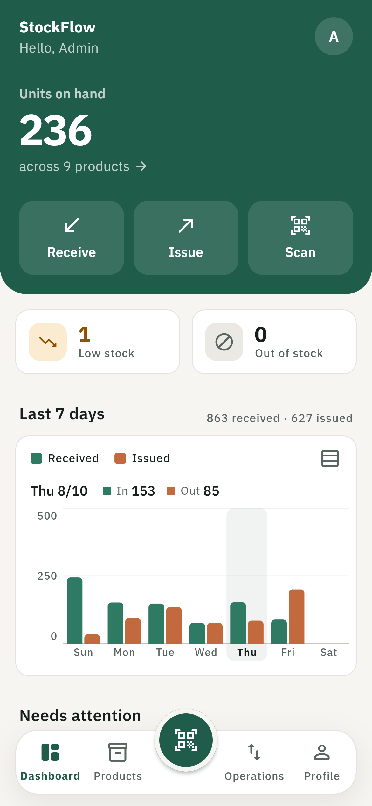
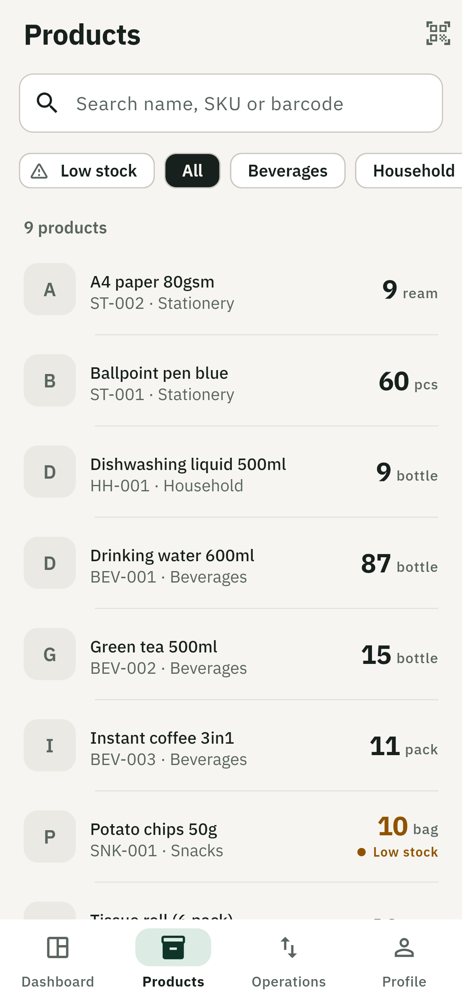
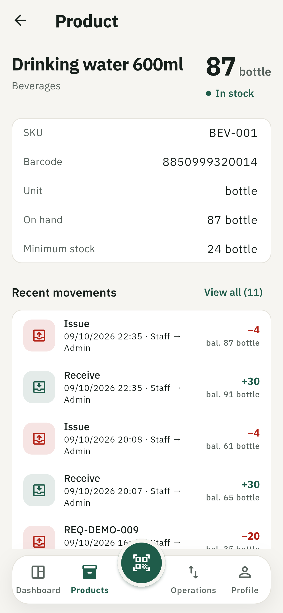
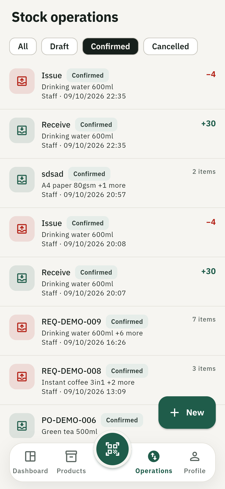
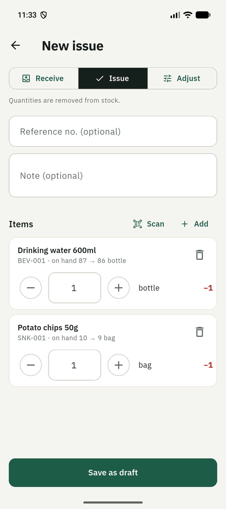
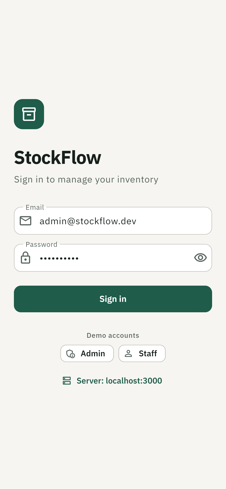

# StockFlow Mobile

**English** | [ภาษาไทย](README.th.md)

[](https://github.com/Foam-01/StockFlowMobile/actions/workflows/ci.yml)

**Inventory & field operations in one mobile app.** The warehouse receives,
issues and adjusts stock. Managers create work orders and technicians
complete them on site: checklist, before/after photos, materials issued from
stock. Supervisors review and approve. Every stock movement and every
work-order step is auditable.

- **Mobile:** Flutter · Riverpod · go_router · Dio · mobile_scanner · sqflite
- **Backend:** NestJS · Prisma · PostgreSQL (Neon) · JWT · Cloudinary
- Built as a portfolio / demo project, run locally

| Technician: jobs | Technician: job in progress | Supervisor: review |
|---|---|---|
|  |  |  |

| Dashboard | Products | Product & history |
|---|---|---|
|  |  |  |

| Operations | New document | Sign in |
|---|---|---|
|  |  |  |

## How it fits together

1. **Admin** creates a work order: site, checklist template, required
   photos, planned materials, technician, optional reviewer.
2. **Warehouse staff** issue the materials: an `ISSUE` document linked to the
   job, pre-filled with what is still needed. Stock moves only when an admin
   confirms it.
3. **Technician** starts the job, ticks the checklist, adds notes and
   before/after photos, and submits. The server refuses submission until
   every required item and photo is there.
4. **Supervisor** approves, or requests changes with a reason; the technician
   resumes and resubmits.
5. Every step is recorded in an append-only audit trail.

## Features

**Field operations**
- Work orders with an explicit state machine
  (`OPEN → IN_PROGRESS → SUBMITTED → APPROVED`, or `→ NEEDS_REVISION → IN_PROGRESS`; cancel with a reason)
- Each transition is its own endpoint, checked on the server and applied
  atomically with its audit event. Repeating a transition is harmless, and
  concurrent decisions resolve to exactly one.
- Checklists copied from templates (later template edits never change an
  existing job); required before/after photos; planned vs issued materials
  with shortage warnings
- Role-based app: technicians see only their own jobs; supervisors start on
  the review queue; buttons follow the server's `allowedActions`

**Inventory**
- **Dashboard:** stock KPIs, received vs issued over the last 7 days, products that need attention, recent activity
- **Products:** search, category and low-stock filters, product photos, infinite scroll
- **Barcode scanner:** scan to open a product, or scan items into a document (re-scan adds +1)
- **Stock documents:** `RECEIVE`, `ISSUE` and `ADJUST`; `DRAFT` → `CONFIRMED` / `CANCELLED`
  - stock only changes on confirm (admin), and can never go below zero, even with concurrent confirms
  - resending with the same `clientUuid` never creates a duplicate
- **Evidence photos:** camera or gallery, uploaded straight to Cloudinary with server-signed, format- and size-limited requests
- **Offline mode:** documents saved without a connection are queued in SQLite and synced automatically (no duplicates); products stay searchable and scannable offline
- **History & audit:** movements per product with running balance; ledger vs cached stock check

**Engineering**
- Server-side authorization on every endpoint, with resource-level checks (a
  technician asking for someone else's job gets `404`)
- Rate limiting, request logs without tokens or bodies, retries for a
  sleeping serverless database
- Loading, empty and error states with retry on every screen; Swagger API docs
- App in **English and Thai** (Flutter gen-l10n, IBM Plex Sans Thai): follows the
  device language, or pick one on the login screen or in Profile

Docs: [architecture](docs/architecture.md) · [work orders](docs/work-orders.md) ·
[offline sync](docs/offline-sync.md) · [security](docs/security.md) ·
[testing](docs/testing.md) · decisions in [docs/adr](docs/adr)

## Project structure

```
.
├── .github/workflows/ci.yml   # backend + API (Postgres) + Flutter checks, release APK
├── backend/   # NestJS API
│   ├── prisma/          # schema, migrations, seeds (accounts, history, work orders, images)
│   ├── src/             # auth, products, stock, dashboard, attachments, work-orders, users
│   └── test/            # API tests against a real Postgres
├── docs/      # architecture, work orders, security, testing, ADRs, screenshots
└── mobile/    # Flutter app
    └── lib/
        ├── core/        # api client, server URL config, router, theme, widgets
        └── features/    # auth, dashboard, products, operations, history, scanner,
                         # offline, work_orders, profile
```

## Getting started

### Prerequisites

- Node.js 22+ (CI uses 24)
- Flutter 3.47+ (Dart 3.13)
- A PostgreSQL database ([Neon](https://neon.tech) has a free tier)
- A [Cloudinary](https://cloudinary.com) account for photos (optional; free tier)
- An Android phone or emulator

### 1. Backend

```bash
cd backend
npm install
cp .env.example .env      # fill in DATABASE_URL, DIRECT_URL, JWT_SECRET, CLOUDINARY_*
npx prisma migrate deploy
npx prisma db seed        # demo accounts, products, checklist templates
npm run seed:history      # optional: 6 days of demo stock movements
npm run seed:work-orders  # optional: one demo work order in every status
npm run seed:images       # optional: product photos to Cloudinary (see docs/image-credits.md)
npm run start:dev
```

- API: `http://localhost:3000`
- Swagger: `http://localhost:3000/docs`
- Health check: `http://localhost:3000/health`

Without `CLOUDINARY_*`, everything works except photo upload, which reports
"not configured". The demo seeds are re-runnable: they replace their own rows
and keep the stock ledger consistent.

**Demo accounts** (one tap each on the login screen; passwords from `SEED_*_PASSWORD` in `.env`)

| Email | Role | Can |
|---|---|---|
| `admin@stockflow.dev` | ADMIN | everything: confirm stock documents, manage products, create, assign and cancel work orders, review |
| `staff@stockflow.dev` | STAFF (warehouse) | stock drafts, scanning, issuing materials for jobs; jobs read-only |
| `tech@stockflow.dev`, `tech2@stockflow.dev` | TECHNICIAN | own jobs only: start, checklist, photos, submit; product catalogue read-only |
| `supervisor@stockflow.dev` | SUPERVISOR | review queue: approve or request changes; read stock documents |

### 2. Mobile

```bash
cd mobile
flutter pub get
flutter run
```

**Server address.** On the login screen, tap **Server** to set the API URL and
**Test connection**. The setting is saved on the device.

| Running on | API URL |
|---|---|
| Android emulator | `http://10.0.2.2:3000` (default) |
| Web / desktop | `http://localhost:3000` (default) |
| Physical phone | `http://<your PC's Wi-Fi IP>:3000` |

For a physical phone: same Wi-Fi as the PC, and allow inbound TCP 3000 in the
PC's firewall. You can also bake the URL in at build time with
`--dart-define=API_URL=http://192.168.1.10:3000`.

### APK

Every push to `main` builds a release APK in GitHub Actions. Download it from
the **stockflow-apk** artifact of the latest
[CI run](https://github.com/Foam-01/StockFlowMobile/actions/workflows/ci.yml).
To build one locally:

```bash
cd mobile
flutter build apk --release   # build/app/outputs/flutter-apk/app-release.apk
```

The APK is signed with the debug key, which is fine for a demo install but
not for Play Store release.

## Main API endpoints

| Method | Path | Description |
|---|---|---|
| POST | `/auth/login` | Log in |
| GET | `/auth/me` | Current user |
| GET | `/dashboard` | KPIs, 7-day flow, needs attention, recent activity |
| GET | `/products` | List / search / filter products |
| GET | `/products/barcode/:barcode` | Find a product by barcode |
| POST / PATCH / DELETE | `/products/:id` | Manage products (admin) |
| POST | `/transactions` | Create a stock draft, optionally linked to a work order |
| POST | `/transactions/:id/confirm` | Confirm, which applies stock (admin) |
| POST | `/transactions/:id/cancel` | Cancel a draft |
| GET | `/products/:id/movements` | Movement history with running balance |
| GET | `/work-orders` | Work orders visible to the caller (search, status filter) |
| POST | `/work-orders` | Create (admin, idempotent with `clientUuid`) |
| GET | `/work-orders/:id` | Detail with `allowedActions` and submit blockers |
| POST | `/work-orders/:id/{start,submit,approve,request-changes,cancel}` | State transitions |
| PUT | `/work-orders/:id/checklist/:itemId` | Tick an item / add a note |
| POST / DELETE | `/work-orders/:id/evidence[/:id]` | Photos (signed upload) |
| GET | `/work-orders/:id/events` | Audit trail |
| GET | `/health` | Liveness check (no auth) |

The full list is in Swagger at `/docs` and in [docs/work-orders.md](docs/work-orders.md#api).

## Tests

| Suite | Count |
|---|---|
| Backend unit (rules: stock, work orders, dashboard, signing, retry) | 48 |
| Backend API tests against a real Postgres (auth, roles, transitions, concurrency, idempotency, inventory link) | 54 |
| Flutter widget / unit tests | 65 |

```bash
cd backend && npm test          # unit tests
cd backend && npm run test:e2e  # API tests; needs a disposable local Postgres (docs/testing.md)
cd mobile && flutter test
```

CI runs all of the above on every push and pull request, plus typecheck,
lint, format, analyze and a release APK build. What is **not** covered yet
(on-device testing, UI end-to-end) is listed in [docs/testing.md](docs/testing.md).

## Demo

<!-- Add a short screen recording link here (e.g. YouTube / Google Drive). -->
_Demo video coming soon._
