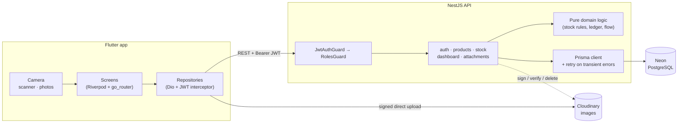
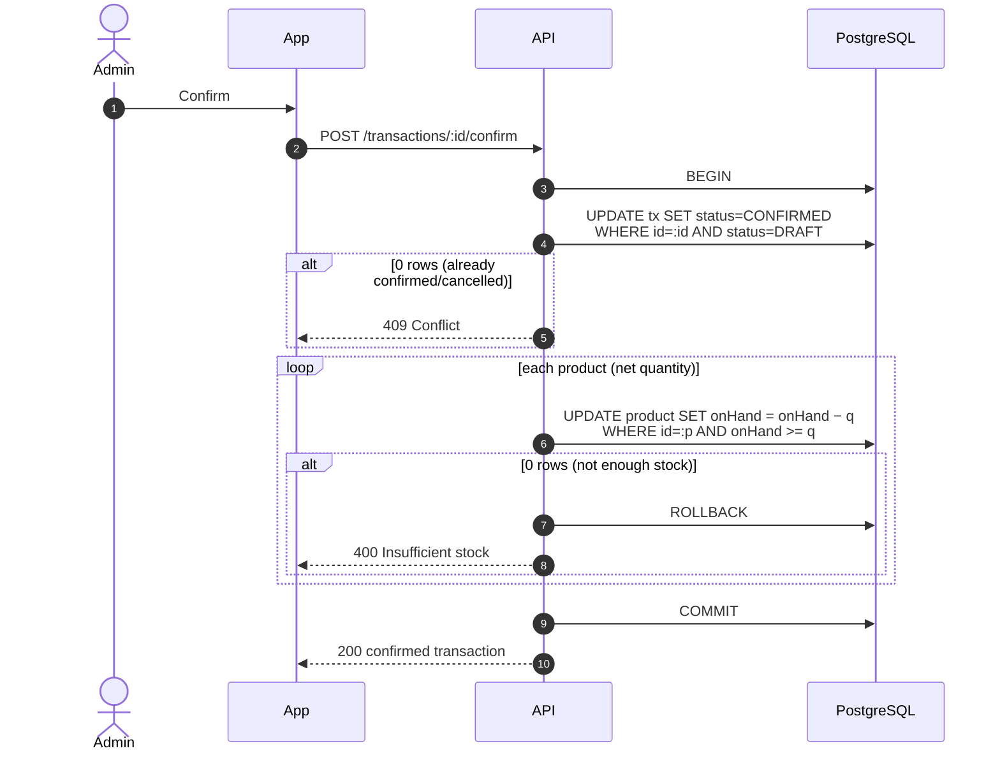
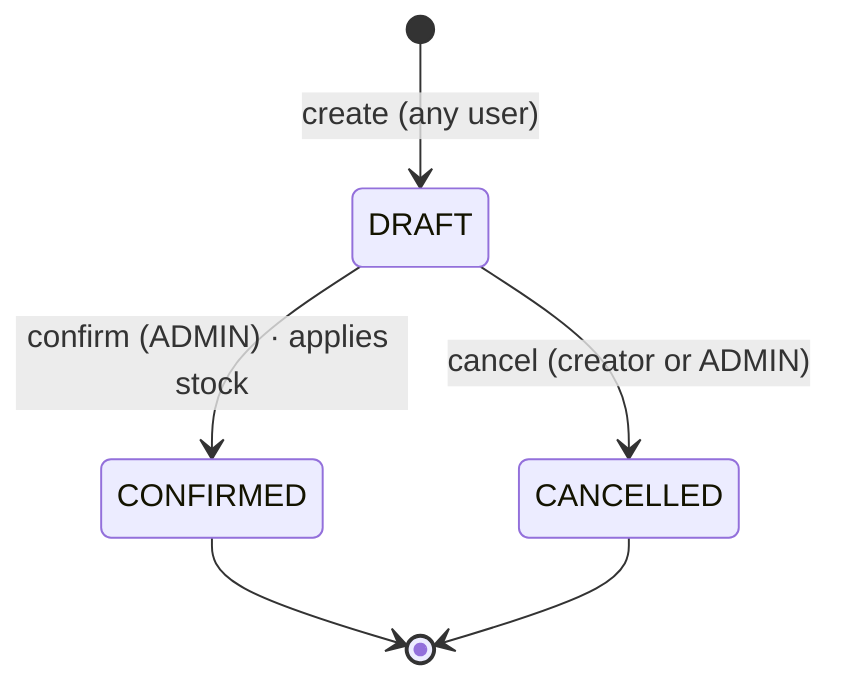
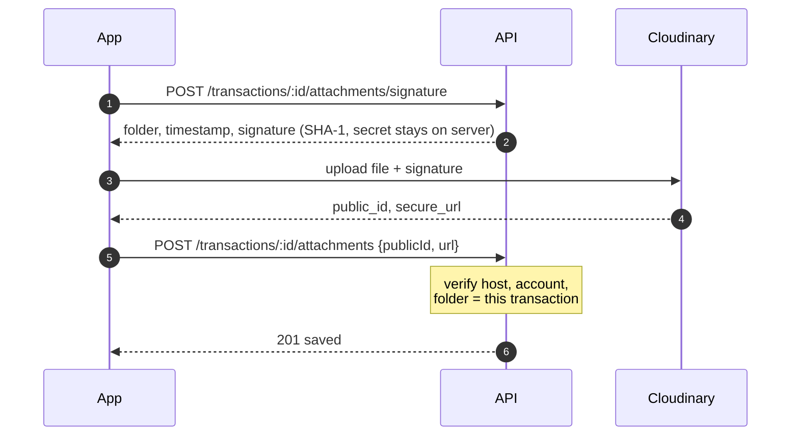
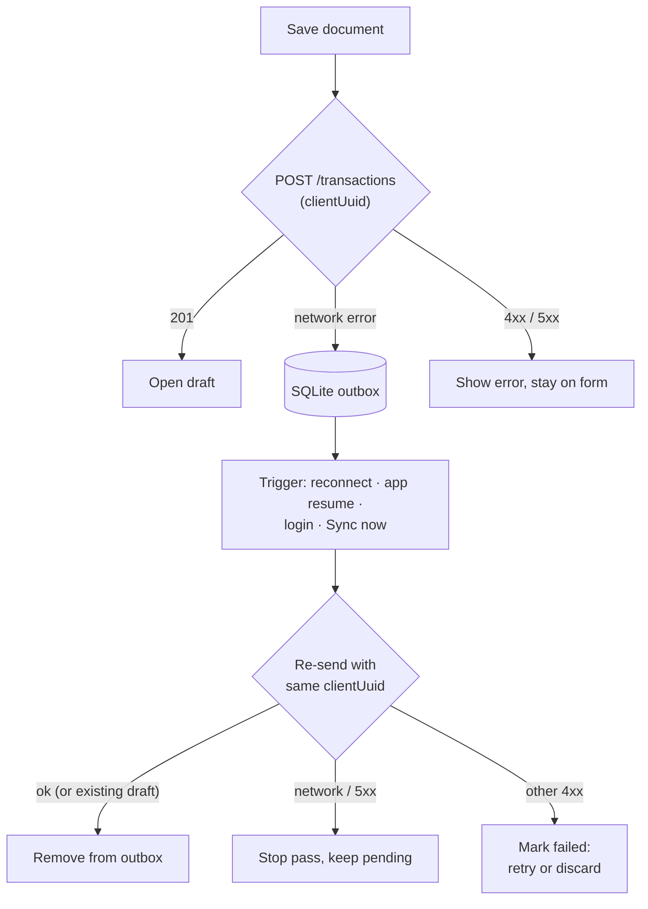
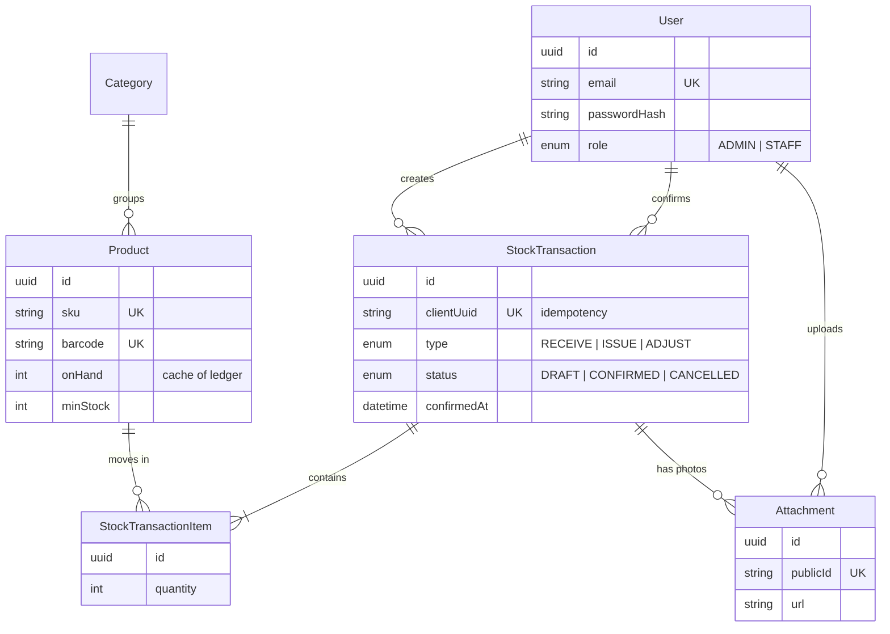

# Architecture

**English** | [ภาษาไทย](architecture.th.md)

## System overview



- The app only talks to the API (plus direct image uploads). No database
  credentials or Cloudinary secret are ever on the phone.
- **Business rules live in the API**, in plain functions with no Nest/Prisma
  imports (`stock-logic.ts`, `dashboard-logic.ts`, `cloudinary.ts`) so they
  are easy to unit test.

## Stock is a ledger

`products.onHand` is a cache. The source of truth is the sum of **confirmed**
transaction lines:

| Type | Effect on stock |
|---|---|
| `RECEIVE` | `+quantity` |
| `ISSUE` | `−quantity` |
| `ADJUST` | signed `quantity` (correction after a count) |

`GET /products/:id/audit` recomputes the ledger and compares it with
`onHand`; `GET /products/:id/movements` returns each movement with the
running balance, ordered by **confirmation** time.

### Confirming a document



Both guards are **conditional updates**, so two people confirming at the same
time can never double-apply a document or drive stock below zero, without
explicit locks.

### Lifecycle



Creating a draft with a `clientUuid` the server has already seen returns the
original draft, so a retried request (including the offline queue) never
creates duplicates.

## Evidence photos



Limits: 5 photos per transaction; only the creator or an admin can add or
delete; not on cancelled transactions. Thumbnails use Cloudinary on-the-fly
transforms (`c_fill,w_300,h_300,q_auto,f_auto`).

## Offline mode



- **Outbox** (`outbox` table): documents saved without a connection, sent
  oldest-first. A network error stops the pass, since everything after it
  would fail too. A rejected item is marked *failed* with the server's reason
  and never blocks the rest of the queue.
- **No duplicates:** the `clientUuid` is created once per form. If the first
  attempt actually reached the server but the response was lost, the retry
  gets the same draft back.
- **Product cache** (`product_cache` table): every product the app sees is
  cached, so search, the item picker and barcode scanning keep working
  offline. Server errors (e.g. 404) are never hidden by the cache.
- Confirming and cancelling stay **online-only** on purpose: they change real
  stock, which needs the server's current balance.

## Data model



## Mobile app structure

Feature-first, each feature split into `data` (API + DTOs), `domain`
(models, pure rules) and `presentation` (screens + Riverpod providers):

```
lib/
  core/        api client, config (server URL), errors, router, shared widgets
  features/
    auth/ dashboard/ products/ operations/ history/ scanner/ profile/
```

- Every screen handles **loading, empty and error** states with retry.
- Devices and services that can't run in tests (camera, image picker,
  network) sit behind providers that tests override.

## Reliability notes

- **Neon cold starts:** the compute sleeps when idle and drops pooled
  connections. The API retries connection errors (`P1001/P1002/P1017/P2024`)
  with backoff, retries the confirm transaction as a whole, and recycles idle
  connections (`max_idle_connection_lifetime=60`).
- **Time zones:** dashboard day buckets use the phone's UTC offset.
