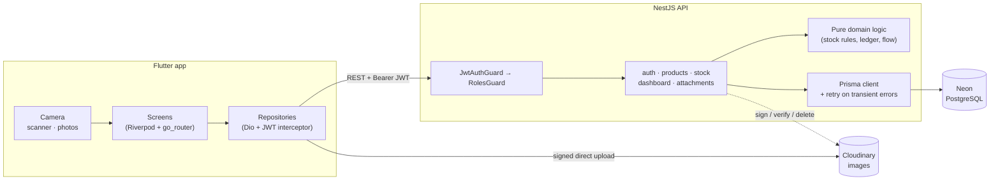
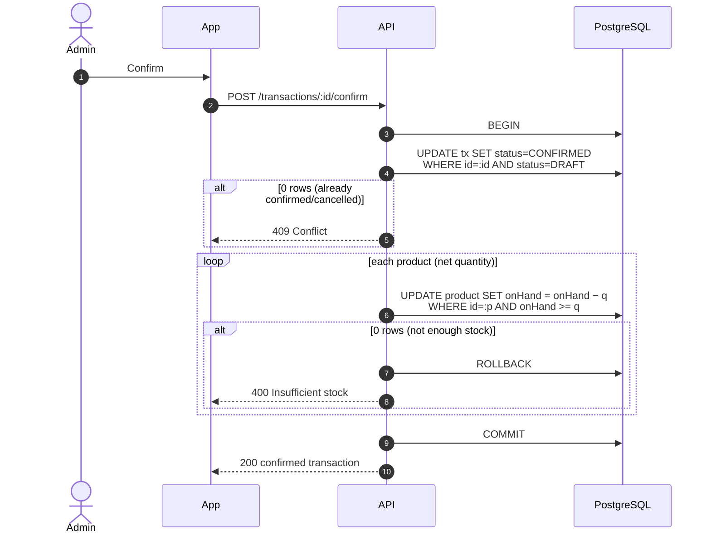
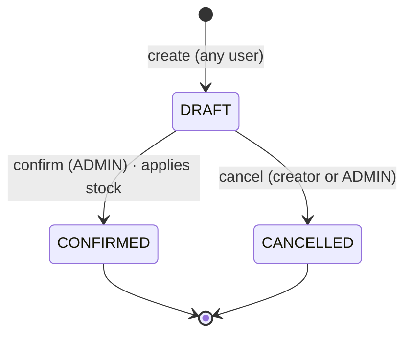
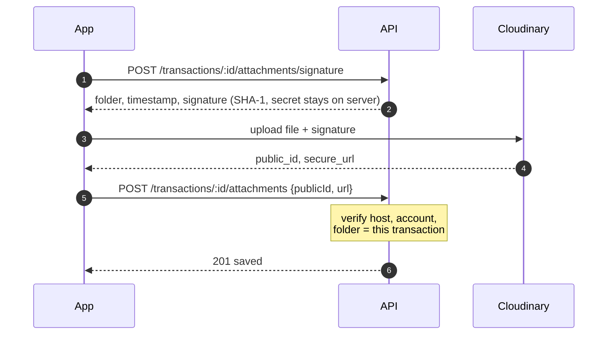
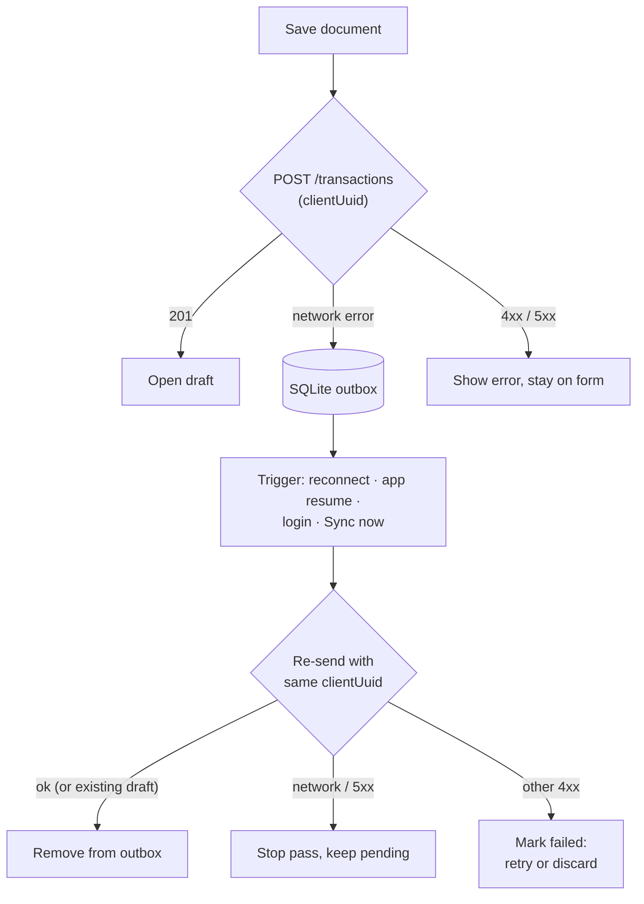
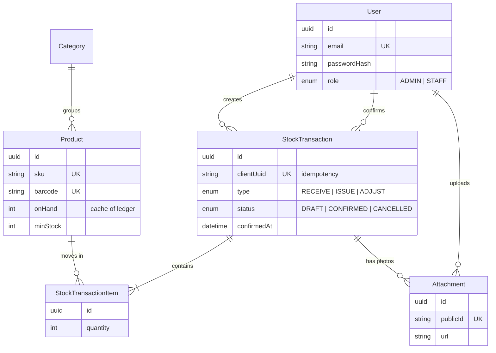

# สถาปัตยกรรม

[English](architecture.md) | **ภาษาไทย**

## ภาพรวมระบบ



- แอปคุยกับ API เท่านั้น (ยกเว้นการอัปโหลดรูปที่ส่งตรงไป Cloudinary) ไม่มีรหัสฐานข้อมูลหรือ Cloudinary secret อยู่บนมือถือเลย
- **กฎทางธุรกิจอยู่ที่ API** เขียนเป็นฟังก์ชันธรรมดาที่ไม่ผูกกับ Nest/Prisma (`stock-logic.ts`, `dashboard-logic.ts`, `cloudinary.ts`) จึงเขียน unit test ได้ง่าย

## สต็อกคือ ledger

`products.onHand` เป็นแค่ค่า cache ส่วนความจริงคือผลรวมของรายการที่ **ยืนยันแล้ว**:

| ประเภท | ผลต่อสต็อก |
|---|---|
| `RECEIVE` | `+quantity` |
| `ISSUE` | `−quantity` |
| `ADJUST` | `quantity` แบบมีเครื่องหมาย (แก้ยอดหลังตรวจนับ) |

`GET /products/:id/audit` คำนวณ ledger ใหม่แล้วเทียบกับ `onHand` ส่วน `GET /products/:id/movements` คืนแต่ละรายการพร้อมยอดคงเหลือสะสม เรียงตาม**เวลาที่ยืนยัน**

### การยืนยันเอกสาร



ทั้งสองจุดเป็น **conditional update** ต่อให้สองคนกดยืนยันพร้อมกัน ก็ไม่มีทางตัดสต็อกซ้ำหรือทำให้สต็อกติดลบ โดยไม่ต้องล็อกตาราง

### วงจรชีวิตเอกสาร



ถ้าสร้าง draft ด้วย `clientUuid` ที่ server เคยเห็นแล้ว จะได้ draft เดิมกลับไป การส่งซ้ำ (รวมถึงคิวออฟไลน์) จึงไม่สร้างรายการซ้ำ

## รูปแนบหลักฐาน



ข้อจำกัด: ไม่เกิน 5 รูปต่อรายการ เพิ่มหรือลบได้เฉพาะผู้สร้างหรือ Admin และแนบกับรายการที่ยกเลิกแล้วไม่ได้ รูปย่อให้ Cloudinary ย่อให้ทันที (`c_fill,w_300,h_300,q_auto,f_auto`)

## โหมดออฟไลน์



- **Outbox** (ตาราง `outbox`): เอกสารที่บันทึกตอนไม่มีเน็ต ส่งตามลำดับเก่าไปใหม่ ถ้าเจอปัญหาเน็ตจะหยุดรอบนั้นไว้ก่อน เพราะรายการถัดไปก็จะล้มเหมือนกัน ส่วนรายการที่ server ปฏิเสธจะถูกทำเครื่องหมาย *failed* พร้อมเหตุผล โดยไม่ขวางรายการอื่น
- **ไม่เกิดรายการซ้ำ:** `clientUuid` สร้างครั้งเดียวต่อฟอร์ม ถ้าครั้งแรกไปถึง server แล้วแต่คำตอบหายระหว่างทาง ตอนส่งซ้ำจะได้ draft เดิมกลับมา
- **Product cache** (ตาราง `product_cache`): สินค้าทุกตัวที่แอปเคยโหลดจะถูกเก็บไว้ ค้นหา เลือกสินค้า และสแกนบาร์โค้ดจึงยังใช้ได้ตอนออฟไลน์ แต่ error จาก server (เช่น 404) จะไม่ถูกซ่อนด้วย cache
- การยืนยันและยกเลิกเอกสาร**ต้องออนไลน์เท่านั้น**โดยตั้งใจ เพราะเป็นการเปลี่ยนสต็อกจริง ต้องใช้ยอดล่าสุดจาก server

## โครงสร้างข้อมูล



## โครงสร้างแอปมือถือ

จัดแบบ feature-first แต่ละ feature แบ่งเป็น `data` (API + DTO), `domain` (model และกฎล้วน) และ `presentation` (หน้าจอ + Riverpod provider):

```
lib/
  core/        api client, config (server URL), errors, router, shared widgets
  features/
    auth/ dashboard/ products/ operations/ history/ scanner/ profile/
```

- ทุกหน้าจอรองรับสถานะ **loading, empty และ error** พร้อมปุ่มลองใหม่
- ส่วนที่รันในเทสต์ไม่ได้ (กล้อง, image picker, network) อยู่หลัง provider ที่เทสต์ override ได้

## ความทนทานของระบบ

- **Neon หลับเมื่อว่าง:** Neon หลับเมื่อไม่มีการใช้งานและตัดการเชื่อมต่อที่ค้างไว้ API จึงลองใหม่อัตโนมัติเมื่อเจอ error การเชื่อมต่อ (`P1001/P1002/P1017/P2024`), ลองยืนยันใหม่ทั้ง transaction และปิดการเชื่อมต่อที่ว่างนานก่อน (`max_idle_connection_lifetime=60`)
- **เขตเวลา:** การแบ่งวันใน Dashboard ใช้เขตเวลาของมือถือ
