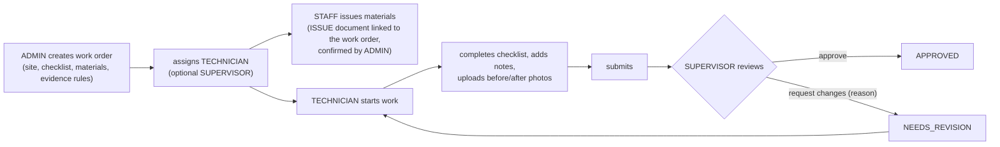
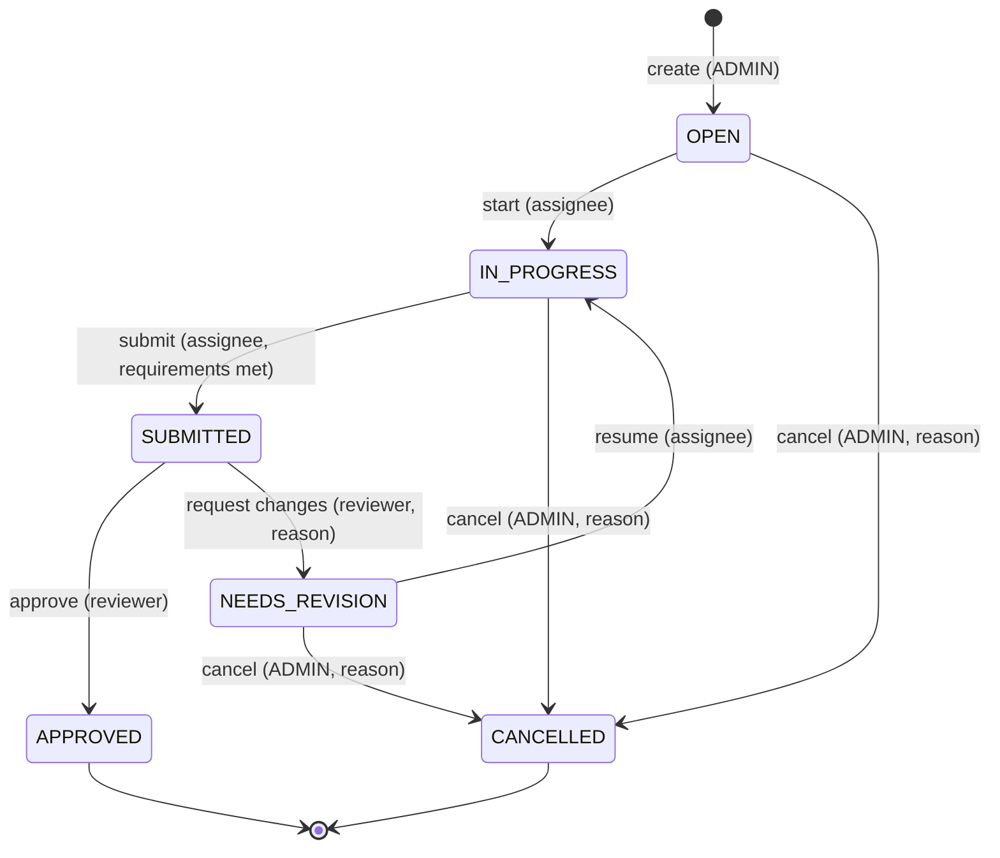
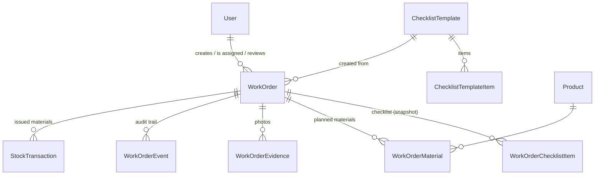

# Work orders (field operations)

Design for the field-operations module that extends the inventory system.
Status: **implemented in phases**; anything not listed under "Implemented"
in the README is planned, not done.

## Business flow

Starting or finishing work **never** changes stock. Materials move only
through explicit, confirmed stock documents (see Inventory link).

## Roles

The existing `ADMIN` and `STAFF` keep their meaning; two roles are added
(`ALTER TYPE … ADD VALUE`, existing users unchanged).

| Role | Meaning |
|---|---|
| `ADMIN` | manager/administrator: everything, including creating and assigning work orders |
| `STAFF` | warehouse staff: inventory, stock document drafts, issuing materials |
| `TECHNICIAN` | field technician: works on work orders assigned to them |
| `SUPERVISOR` | reviews submitted work |

## State machine

- Every transition is its own endpoint (no generic status `PATCH`).
- Applied with a **conditional update** (`WHERE id = … AND status IN (…)`),
  so two concurrent requests can't both succeed.
- **Idempotent:** repeating a transition that already happened (e.g. approve
  twice) returns the current work order without a second event.
- Every transition writes a `WorkOrderEvent` in the **same database
  transaction**.
- `APPROVED` and `CANCELLED` are terminal.

### Submit requirements (checked on the server)

1. Every **required** checklist item is done.
2. For every category in `requiredEvidence` (`BEFORE`, `AFTER`) at least one
   photo exists.

The API returns `400` with the list of what is missing.

## Permissions (deny by default)

| Action | ADMIN | STAFF | TECHNICIAN | SUPERVISOR |
|---|---|---|---|---|
| List / view work orders | all | all (read-only, to prepare materials) | **only assigned to them** | all |
| Create, assign, cancel | ✅ | — | — | — |
| Start / resume, checklist, notes, photos, submit | — | — | ✅ if assignee | — |
| Approve / request changes | ✅ | — | — | ✅ (if a reviewer is set, only that supervisor) |
| Create stock documents (incl. issuing materials) | ✅ | ✅ | — | — |
| Confirm stock documents | ✅ | — | — | — |
| View stock documents | ✅ | ✅ | — | ✅ (read) |
| Products (read), scan | all roles | | | |

A technician asking for someone else's work order gets **404** (no leak of
existence). The detail response includes `allowedActions`, computed on the
server, so the app shows exactly the buttons the server would accept; the
server still re-checks every request.

## Data model (additions)

- **Checklist snapshot:** creating a work order copies the template items, so
  later template changes never alter an existing (or submitted) work order.
- **Materials:** planned quantity per product; issued quantity is derived
  from confirmed `ISSUE` documents linked to the work order (minus linked
  `RECEIVE` returns). No reservation engine in this version.
- **Events** are append-only (`onDelete: Restrict`), written only by the
  server.
- Work orders get a human code `WO-00001` from an auto-increment number.
- `clientUuid` on create makes retries safe, as for stock documents.

## Inventory link

- `StockTransaction.workOrderId` (optional). Creating a document with it
  requires the work order to be active (not `APPROVED`/`CANCELLED`).
- Confirming a linked `ISSUE` document records a `MATERIAL_ISSUED` event on
  the work order in the same transaction.
- The work order shows planned vs issued per material and any shortage.

## Evidence

Reuses the signed-upload design (see [security.md](security.md)): one folder
per work order (`stockflow/work-orders/<id>`), same format/size limits, same
server-side check that the image is ours and in the right folder. Each photo
has a category (`BEFORE`, `AFTER`, `OTHER`) and an optional note. Only the
assignee can add or remove photos, and only while the work order is
`IN_PROGRESS`.

## API

| Method | Path | Who |
|---|---|---|
| GET | `/work-orders?status&priority&q&page&limit` | scoped by role |
| POST | `/work-orders` | ADMIN |
| GET | `/work-orders/:id` | scoped |
| GET | `/work-orders/:id/events` | scoped |
| PATCH | `/work-orders/:id/assignment` | ADMIN |
| POST | `/work-orders/:id/start` | assignee |
| PUT | `/work-orders/:id/checklist/:itemId` | assignee |
| POST | `/work-orders/:id/evidence/signature` | assignee |
| POST / DELETE | `/work-orders/:id/evidence[/:evidenceId]` | assignee |
| POST | `/work-orders/:id/submit` | assignee |
| POST | `/work-orders/:id/approve` | reviewer |
| POST | `/work-orders/:id/request-changes` | reviewer (reason required) |
| POST | `/work-orders/:id/cancel` | ADMIN (reason required) |
| GET | `/checklist-templates` | ADMIN |
| GET | `/users?role=` | ADMIN (assignment pickers) |

## Not in this version

Stock reservation, editable checklist templates, push notifications,
offline work-order execution, GPS/maps, multi-level approval, PDF reports.
